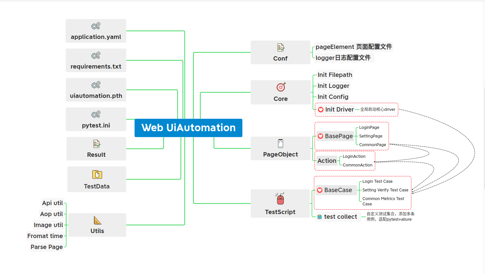

# Web UIAutomation 自动化框架介绍

## 开发背景
   1. 手动Smoke比较繁琐，项目比较成熟，迭代比较稳定，UI元素的变化不大，可以开始尝试自动化的执行
   2. UI自动化和API自动化，都是CICD中自动化测试的基础部件

## 框架图:

## 框架配置说明:
   1. PageObject中解析自己的页面元素
   2. Action中组装模拟动作
   3. TestScript中组合自己的action行为模拟操作流程

## 使用指南:
   1. 依赖下载配置
   2. 配置文件
   3. 本地方法运行
   4. pytest远端运行
   5. 报告查看
   6. [自动化用例合集]
   7. [Selenium Hub]

## ToDo List:
   1. 各page中详细的页面元素id定义，统一在Conf/page_element.yaml文件中(需要开发配合)
   2. 全局元素action和verify方法封装
   3. 图片对比公共方法封装
   4. pytest+allure，组合封装和装饰器定义
   5. jenkins接入，slack接入
   6. 脚本并发设计，多case运行启动多个local driver或者remote driver
   7. selenium node基于k8s动态扩展集群(适配脚本的并发运行)